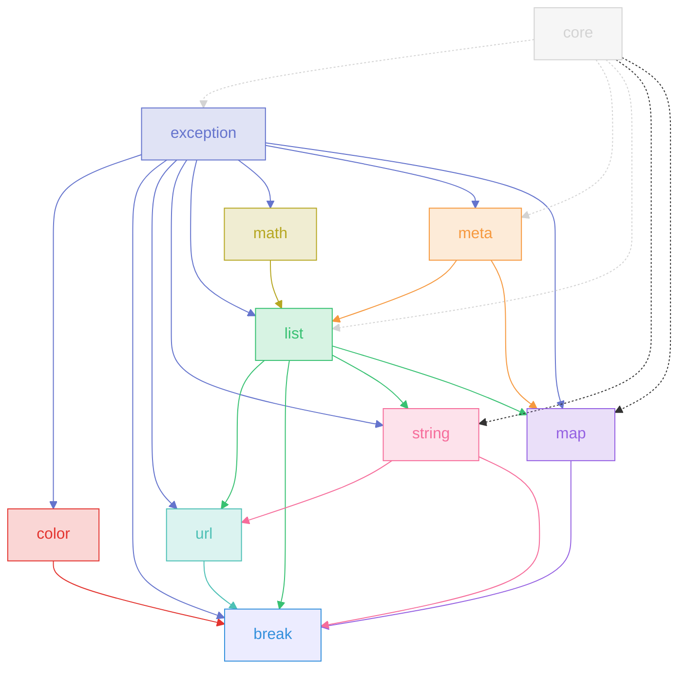

# Sass Fairy

Sass Fairy enhances built-in Sass modules with additional functions and adds modules for handling breakpoints and exceptions. The primary goal is to abstract common functionality which aids in the rapid development of domain specific stylesheets and modules.

<!--

## Packing / Publishing

pnpm cross-env BUILD=exception pnpm package
pnpm cross-env BUILD=exception pnpm publish-package

-->

## Core Modules

This set of modules extend the natively [built-in modules](https://sass-lang.com/documentation/modules) provided by Sass.

### [@sass-fairy/color](https://github.com/roydukkey/sass-fairy/tree/dev/v2/packages/color#readme) 

### [@sass-fairy/list](https://github.com/roydukkey/sass-fairy/tree/dev/v2/packages/list#readme) 

### [@sass-fairy/map](https://github.com/roydukkey/sass-fairy/tree/dev/v2/packages/map#readme) 

### [@sass-fairy/math](https://github.com/roydukkey/sass-fairy/tree/dev/v2/packages/math#readme) 

### [@sass-fairy/meta](https://github.com/roydukkey/sass-fairy/tree/dev/v2/packages/meta#readme) 

### [@sass-fairy/string](https://github.com/roydukkey/sass-fairy/tree/dev/v2/packages/string#readme) 

## Special Modules

This set of modules are other concepts and utilities which can be used to aid in developing other modules or designing stylesheets.

### [@sass-fairy/break](https://github.com/roydukkey/sass-fairy/tree/dev/v2/packages/break#readme) 

### [@sass-fairy/exception](https://github.com/roydukkey/sass-fairy/tree/dev/v2/packages/exception#readme) 

### [@sass-fairy/url](https://github.com/roydukkey/sass-fairy/tree/dev/v2/packages/url#readme) 

## Dependency Graph

